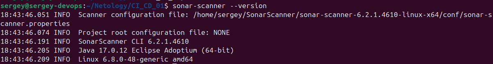
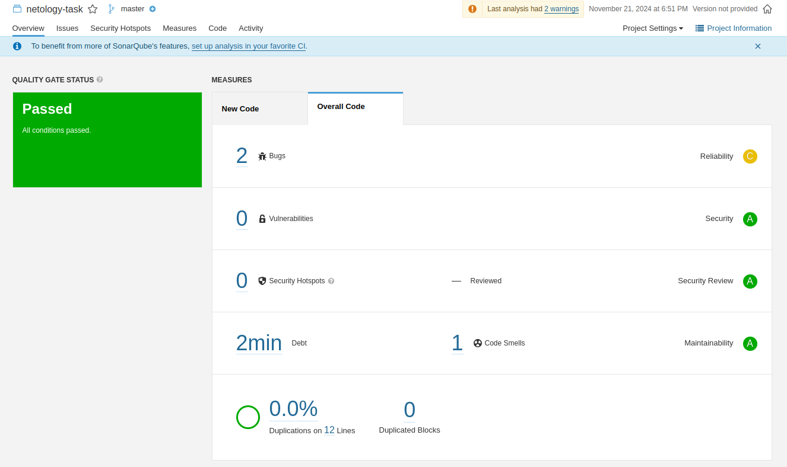
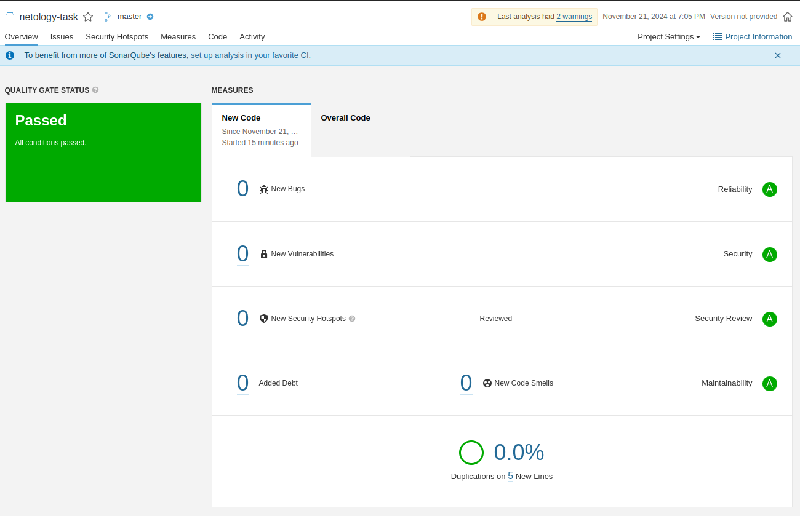
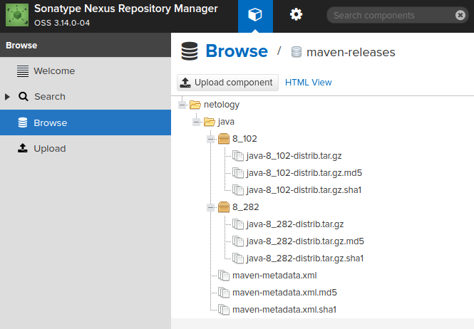
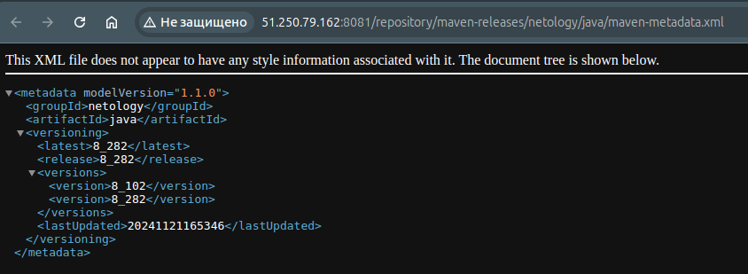
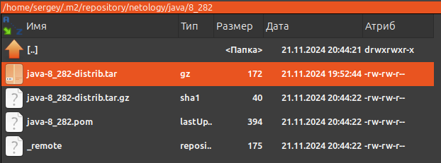

[Задание](https://github.com/netology-code/mnt-homeworks/blob/MNT-video/09-ci-03-cicd/README.md)

## Подготовка к выполнению
- Готовим [`prepare_hosts_yc`](prepare_hosts_yc), запускаем `terraform init`, `terraform apply` 

- Запускаем playbook: `ansible-playbook -i inventory/cicd/hosts.yml  site.yml`
С плейбуком были проблемы, начиная с того, что не работает yum, невозможно установить ниодного пакета. Поэтому взял за основу Centos 9 и убрал копирование `CentOS-Base.repo` на сервер.
Следующая проблема в таске `Install PostgreSQL`, 
`name: "postgresql{{ postgresql_version }}-server"` не сработал. Заменил на `name: "postgresql-server"`, пришлось поменять несколько tasks.

- Проверил в браузере, `sonarqube` и `nexus` открываются.
- Для упрощения разворачивания сделал compose.yml, который ставит всё в контейнерах.

## SonarQube
- Создаём проект, скачиваем архив sonar-scanner, распаковываем, добавляем путь (из bin sonar-scanner):  
`export PATH=$PATH:$(pwd)`  
- Проверяем:  
`sonar-scanner --version`   

- Копируем сгенерированную sonerqube строку запуска sonar-scanner:  
```
sonar-scanner \
  -Dsonar.projectKey=netology-task \
  -Dsonar.sources=. \
  -Dsonar.host.url=http://51.250.9.138:9000 \
  -Dsonar.login=aec1aa6da563eea7f4cdc4592bbb43517ad2d909
```
- Добавляем строку `-Dsonar.coverage.exclusions=fail.py`:  
```
sonar-scanner \
  -Dsonar.projectKey=netology-task \
  -Dsonar.sources=. \
  -Dsonar.host.url=http://51.250.9.138:9000 \
  -Dsonar.coverage.exclusions=fail.py \
  -Dsonar.login=aec1aa6da563eea7f4cdc4592bbb43517ad2d909
```
- Смотрим результат в web интерфейсе:  
  

- Исправляем ошибки, повторяем запуск команды, убеждаемся, что ошибок нет в web-интерфейсе:
  

## Nexus
Загруженные файлы:
  

[maven-metadata.xml](maven-metadata.xml)


## Maven
Файл на месте  


Файл [pom.xml](pom.xml)

